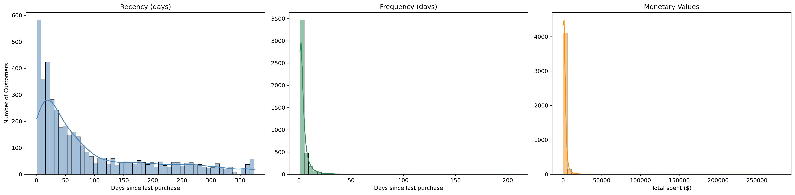
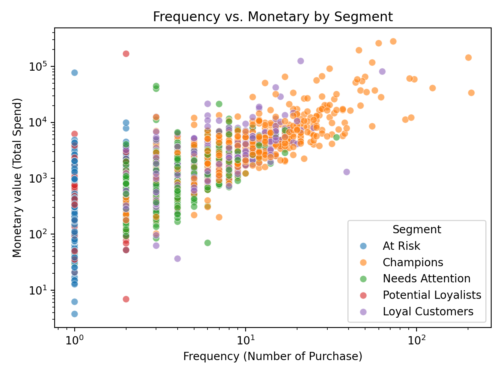
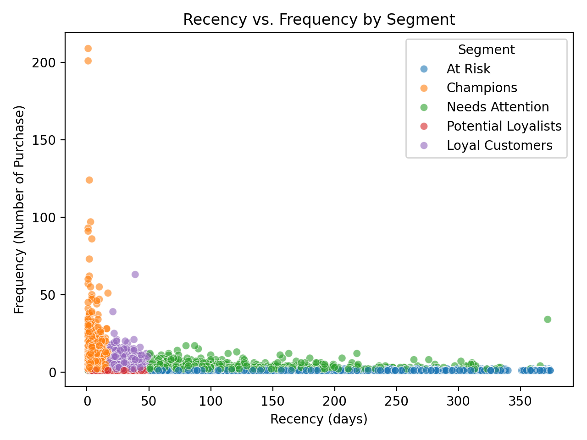
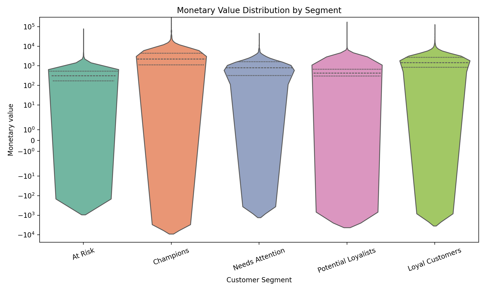
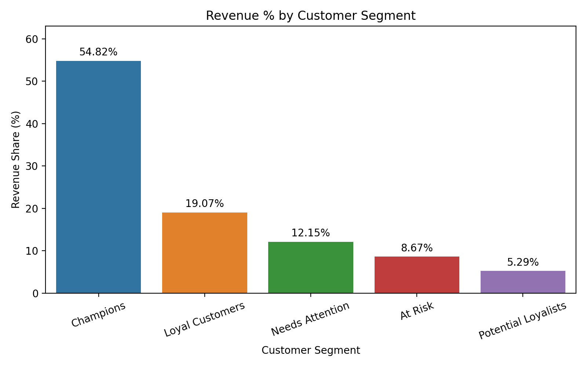

# RFM Analysis - Revenue & Retention

This project performs an **RFM (Recency, Frequency, Monetary) Analysis** on an e-commerce dataset to segment customers based on their purchase behavior.  
The goal is to uncover **customer loyalty tiers, revenue dependency, and churn risk**, providing insights into **who to retain, who to target, and who is at risk**.

---

## Tools & Libraries
- **Python**: Data cleaning, transformation, visualization  
- **Pandas / NumPy**: Data wrangling  
- **Matplotlib / Seaborn**: Visualization  
- **Jupyter Notebook**: Analysis environment  
- **GitHub**: Version control & portfolio hosting  

---

## Key Steps in Analysis
1. **Data Cleaning**
   - Removed missing `CustomerID`s and invalid values (negative quantity/price).
   - Calculated transaction `Amount = Quantity × UnitPrice`.

2. **Feature Engineering**
   - Created Recency (days since last purchase), Frequency (unique transactions), and Monetary (total spend) values.
   - Assigned **R, F, M scores** using percentile binning.

3. **Customer Segmentation**
   - Combined scores into `RFM_Score` and `RFM_Label`.
   - Labeled customers into strategic segments:
     - Champions
     - Loyal Customers
     - Potential Loyalists
     - At Risk
     - Needs Attention

4. **Insights & Business Questions**
   - Which customers contribute the most revenue?
   - Which segments are at risk of churn?
   - How can marketing budget be targeted more effectively?

---

## Key Insights
- **Champions (≈ 55% of revenue)**: The smallest group of customers generates the largest share of revenue.  
- **Loyal Customers (≈ 19%)**: High frequency and spend, critical for long-term retention.  
- **Needs Attention + At Risk (≈ 20%)**: These groups represent churn risk and need tailored campaigns.  
- **Revenue Dependency**: Heavy reliance on Champions makes the business vulnerable if this group churns.

---

## Business Implications
- **Retention Focus**: Prioritize “At Risk” and “Needs Attention” with win-back campaigns.  
- **Upsell Opportunities**: “Loyal Customers” can be nurtured into “Champions.”  
- **Risk Management**: Reduce over-dependency on a small set of customers.  

---

## Visual Highlights
  
*Shape of Recency, Frequency, Monetary (post-cleaning).*

  
*Champions cluster at higher frequency & spend (symlog/log scale).*

  
*How recent vs. frequent purchases distribute by customer segment.*

  
*Distribution of spend by segment.*

  
*Revenue dependency across segments.*

---

## Next Steps
- Build an **interactive Power BI dashboard** for business stakeholders.  
- Extend to **predictive modeling** (e.g., churn prediction using classification models).  
- Automate with **SQL pipelines** for scalability.  

---

## Dataset
The dataset is sourced from [Kaggle – Online Retail Data](https://www.kaggle.com/datasets/carrie1/ecommerce-data).  
- Transactions of a UK-based online retail store from **2010–2011**.  
- Includes **InvoiceNo, StockCode, Description, Quantity, InvoiceDate, UnitPrice, CustomerID, Country**.  

---

## Author
**Ankit Walimbe**  
- Data Analyst | Business Analytics Enthusiast  
- Skilled in **SQL, Python, Power BI, Tableau, Git**  
- Passionate about data-driven problem solving and storytelling  

---
